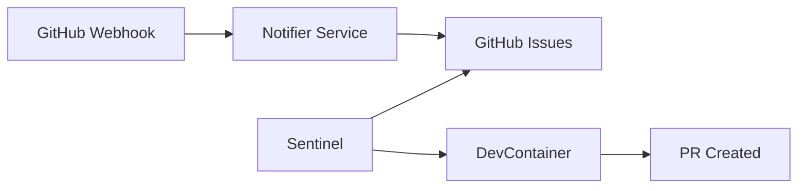

# Architecture Overview

## System Context

workflow-orchestration-queue is a headless agentic orchestration platform that transforms GitHub Issues into automated execution orders for AI-driven development.

## Components

### The Ear (Notifier Service)

- **Technology**: FastAPI, Pydantic, Uvicorn
- **Port**: 8000
- **Endpoint**: `/webhooks/github`
- **Responsibilities**:
  - HMAC signature verification
  - Event triage and classification
  - Queue initialization

### The State (GitHub Issues)

- **State Labels**: `agent:queued`, `agent:in-progress`, `agent:success`, `agent:error`
- **Concurrency**: Assignees as distributed locks
- **Visibility**: Full audit trail in GitHub UI

### The Brain (Sentinel)

- **Technology**: Python async, subprocess
- **Poll Interval**: 60 seconds (configurable)
- **Responsibilities**:
  - Poll for queued tasks
  - Claim via assign-then-verify
  - Dispatch to workers
  - Handle failures

### The Hands (Worker)

- **Technology**: opencode CLI, Docker DevContainer
- **Environment**: Isolated, reproducible
- **Capabilities**:
  - Read instruction modules
  - Execute code changes
  - Run tests
  - Create PRs

## Security Model

- **Network Isolation**: Workers in dedicated Docker network
- **Credential Scoping**: Tokens injected as temp env vars
- **Credential Scrubbing**: Regex-based secret removal from logs
- **Resource Constraints**: 2 CPU, 4GB RAM per worker
